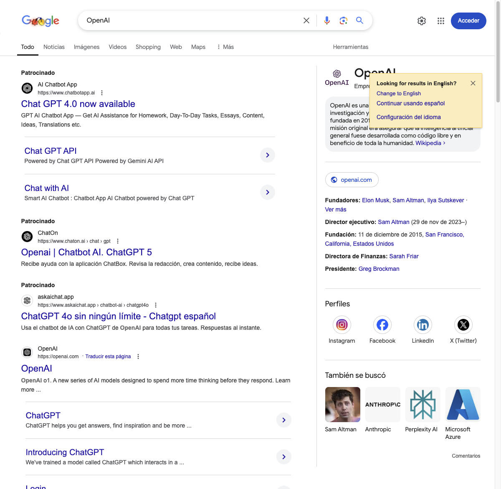

# AI Browser Automation Examples

This document shows detailed examples of how to use the AI Browser Automation package.

## Google Search Example

This example demonstrates how to automate a Google search using AI assistance.

### Code
[Link to code
](https://github.com/jonymusky/ai-browser-automation/blob/main/examples/google-example.ts)

### Execution Output
```bash
$ pnpm run-example google

> ts-node -r dotenv/config scripts/run-example.ts "google"

Executing step: {
  action: 'navigate',
  description: 'Navigate to Google',
  url: 'https://www.google.com'
}
AI Attempt 1/5 for: Search for "OpenAI"
Previous attempts: []
Generating action for prompt: 
      Search for "OpenAI"
      Search strategies:
      - Look for elements with exact text matching
      - Look for elements with aria-label attributes
      - Look for elements with title attributes
      - Look for elements with placeholder text
      - Look for elements with class names containing relevant keywords
      - Look for elements with data-testid attributes
      Previous failed attempts: []
    
Raw Ollama response: {"action": "write", "selector": "input[name=\"q\"]", "value": "OpenAI"}
Cleaned response: {"action": "write", "selector": "input[name=\"q\"]", "value": "OpenAI"}
Parsed response: { action: 'write', selector: 'input[name="q"]', value: 'OpenAI' }
AI suggested action: { action: 'write', selector: 'input[name="q"]', value: 'OpenAI' }
Executing step: {
  action: 'write',
  description: 'Search for "OpenAI"',
  solve_with_ai: true,
  value: 'OpenAI',
  selector: 'input[name="q"]'
}
Failed to write with selector: input[name="q"]
Step executed successfully
Executing step: {
  action: 'write',
  description: 'Search for "OpenAI"',
  solve_with_ai: true,
  value: 'OpenAI',
  selector: 'input[name="q"]'
}
Failed to write with selector: input[name="q"]
AI Attempt 1/5 for: Submit the search
Previous attempts: []
Generating action for prompt: 
      Submit the search
      Search strategies:
      - Look for elements with exact text matching
      - Look for elements with aria-label attributes
      - Look for elements with title attributes
      - Look for elements with placeholder text
      - Look for elements with class names containing relevant keywords
      - Look for elements with data-testid attributes
      Previous failed attempts: []
    
Raw Ollama response: {
  "action": "submit",
  "selector": "textarea[aria-label=\"Buscar\"] OR input[name=\"q\"]",
  "value": ""
}
Cleaned response: {
  "action": "submit",
  "selector": "textarea[aria-label=\"Buscar\"] OR input[name=\"q\"]",
  "value": ""
}
Parsed response: {
  action: 'submit',
  selector: 'textarea[aria-label="Buscar"] OR input[name="q"]',
  value: ''
}
AI suggested action: {
  action: 'submit',
  selector: 'textarea[aria-label="Buscar"] OR input[name="q"]',
  value: ''
}
Executing step: {
  action: 'submit',
  description: 'Submit the search',
  solve_with_ai: true,
  selector: 'textarea[aria-label="Buscar"] OR input[name="q"]',
  value: ''
}
Failed to submit with primary method, trying alternatives...
Step executed successfully
Executing step: {
  action: 'submit',
  description: 'Submit the search',
  solve_with_ai: true,
  selector: 'textarea[aria-label="Buscar"] OR input[name="q"]',
  value: ''
}
Failed to submit with primary method, trying alternatives...
Executing step: {
  action: 'wait',
  description: 'Wait for search results to load',
  selector: '#search',
  timeout: 10000
}
Automation completed: { success: true, screenshot: 'screenshots/google-search-Ollama.png' }
```

### Screenshot

